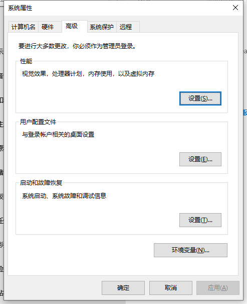

[TOC]

### 1. 获得openCV

首先访问官网[官网](https://opencv.org/releases.html)，可以下载最新的`library`。目前我下载的是`4.0.1`。下载完成后解压到自定义的文件夹下。

**注：假设一个变量`install_dir`为自定义安装的目录(如：`F:\library_box\opencv4\`)，后面安装目录就用这个变量，下面是`Windows10`系统**

### 2. 环境变量

（1）找到高级环境变量窗口



（2）进入后，找到系统变量，点击【path】，点击【编辑】，点击【新建】。复制路径【`install_dir\opencv\build\x64\vc15\bin`】


### 3. Virtual Studio

**注：一定是在x64环境下，如果遇到【x86与x64冲突】【找不到某个方法】等，先检擦一下环境是否一致**

（1）打开VS，我的是VS2019。新建一个空的项目。调整【解决方案】为【debug-x64】。


（2）配置属性【VC++目录】【包含目录】右侧箭头编辑，添加`install_dir\opencv\build\include`和`install_dir\opencv\build\include\opencv2`。【库目录】右侧箭头编辑，添加`install_dir\opencv\build\x64\vc15\lib`


（3）配置属性【链接器】【输入】【附加依赖项】右侧箭头编辑，添加opencv_world400d.lib（在路径`install_dir\opencv\build\x64\vc15\lib`）


### 4. 测试

```c++
#include<opencv2/opencv.hpp>

using namespace cv;
using namespace std;

int main() {
    // 找到一个图片打开
    Mat srcImg = imread("F:\\live_box\\head\\astronaut2.jpg");
    if (srcImg.empty()) {
        cout << "could not load image..." << endl;
        return -1;
    }
    // 展示该图片
    imshow("Test opencv setup", srcImg);
    // 展示灰度图
    Mat grayImg;
    cvtColor(srcImg, grayImg, 6);
    imshow("grayImg", grayImg);
    // 需要保留下面一行代码，否则上面展示图片的窗口会一闪而过
    waitKey(0);
    return 0;
}
```

